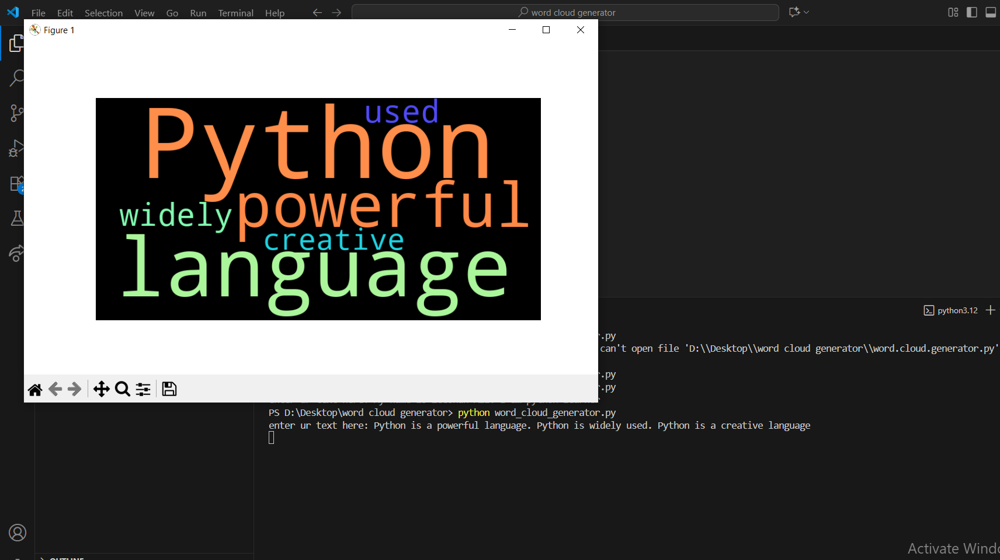

# Word Cloud Generator

## Overview
This project is a simple Word Cloud Generator written in Python. It takes a text input, analyzes the frequency of words, and generates a visual representation (word cloud) where the size of each word reflects its frequency in the text.

## What is Word Clouding?
Word clouding is a technique used to visualize the most frequent words in a body of text. Words that appear more often are displayed larger and bolder, making it easy to identify key themes and topics at a glance. Word clouds are commonly used in data analysis, presentations, and reports to summarize textual data.

## Features
- Reads text input and analyzes word frequency
- Generates a word cloud image
- Easy to use and customize

## How to Use
1. Run `word_cloud_generator.py`.
2. Provide your text input as required by the script.
3. The script will generate a word cloud image and save it in the `screenshots` folder.

## Screenshots
Below is an example of a generated word cloud:

## Requirements
- Python 3.x
- Required libraries (see code for details)

## License
This project is open source and free to use.
